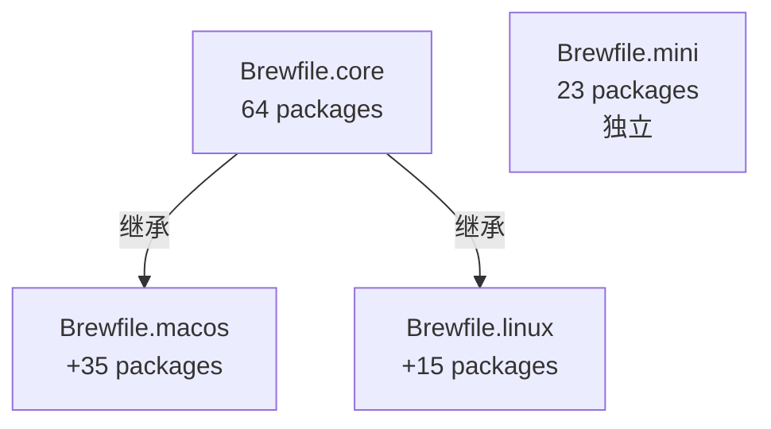

# Homeup 架构设计文档

> 现代化、安全、智能的 Dotfiles 管理系统设计理念与实现

**版本**: v2.1
**更新日期**: 2026-01-13

---

## 📋 目录

- [概述](#概述)
- [核心设计理念](#核心设计理念)
- [架构设计](#架构设计)
  - [三层继承模型](#三层继承模型)
  - [Profile 隔离策略](#profile-隔离策略)
  - [包管理策略](#包管理策略)
- [技术栈](#技术栈)
- [工作流程](#工作流程)
- [设计决策](#设计决策)
- [扩展性](#扩展性)

---

## 概述

### 项目定位

Homeup 是一个面向**独立开发者和技术团队**的生产级 Dotfiles 管理系统，致力于：

- 🎯 **统一配置管理**: 一套配置，多种环境（macOS、Linux、容器）
- 🔒 **分层安全设计**: 根据环境信任级别自动调整安全策略
- 📦 **精选工具链**: 102 个经过筛选的现代化 CLI 工具
- 🤖 **全自动化**: 从安装到日常维护全流程自动化
- ✅ **生产级质量**: 完整的 CI/CD 测试，8 个并行测试任务

### 核心目标

1. **简化多环境配置同步**: 在个人 MacBook、远程 Linux 服务器、GitHub Codespaces 之间无缝切换
2. **提升开发效率**: 通过精选的现代化工具和最佳实践配置
3. **保障配置安全**: 分层设计，敏感信息仅在可信环境中启用
4. **降低学习成本**: 场景化的最佳实践和完善的文档体系

---

## 核心设计理念

### 1. 分层而非单一

**问题**: 传统 Dotfiles 管理通常是一套配置打天下，导致：
- 在不可信环境中暴露敏感信息（GPG key, 1Password）
- 在轻量级环境中安装过多工具（容器膨胀）
- 无法针对不同场景优化工作流

**解决方案**: 三层架构

```
Core Layer (64 packages)
├─ macOS Profile (+35: GUI + Security)
└─ Linux Profile (+15: Server tools)

Mini Profile (23 packages, 独立)
```

**优势**:
- Core: 共享的通用工具，避免重复
- Profile: 针对场景的特定工具
- Mini: 完全独立，快速启动

### 2. 安全优先

**信任级别分层**:

| Profile | 信任级别 | GPG 签名 | 硬件密钥 | 敏感工具 |
|---------|---------|---------|---------|---------|
| macOS | **高** (个人设备) | ✅ 启用 | ✅ YubiKey | ✅ 1Password |
| Linux | **中** (远程 SSH) | ❌ Forwarding | ❌ 无 | ❌ 无 |
| Mini | **低** (临时容器) | ❌ 禁用 | ❌ 无 | ❌ 无 |

**原则**:
- 敏感密钥仅保存在个人设备 (macOS)
- 远程环境通过 SSH Agent Forwarding 使用
- 临时环境不保存任何密钥

### 3. 自动化至上

**设计目标**: 用户无需记忆复杂流程

```bash
# 新机器设置 (一条命令)
curl -fsSL https://raw.githubusercontent.com/zopiya/homeup/main/bootstrap.sh | bash

# 日常使用 (语义化命令)
just apply          # 应用配置
just diff           # 查看变化
just doctor         # 健康检查
```

**自动化范围**:
- 环境检测 (自动识别 OS、架构、Profile)
- 包管理 (验证、安装、更新、清理)
- 配置应用 (模板渲染、权限设置)
- 故障诊断 (doctor, debug, rescue)

### 4. 可扩展性

**设计支持**:
- 添加新 Profile (按需创建 Brewfile.xxx)
- 添加新工具 (编辑 Brewfile 即可)
- 自定义配置 (Chezmoi 模板系统)
- 场景化实践 (docs/best-practices.md)

---

## 架构设计

### 三层继承模型

#### Layer 0: Core (基础层)

**64 个包** - 跨平台通用工具

```
📦 Brewfile.core
├─ Shell 工具: zsh, starship, sheldon, zoxide, fzf, atuin
├─ 现代替代: bat, eza, fd, ripgrep, sd, dust, duf, procs, btop
├─ 开发基础: git, gh, lazygit, neovim, tmux, direnv
├─ 任务运行: just, lefthook, entr, watchexec
├─ 包管理: mise, uv, pnpm
├─ 网络工具: httpie, xh, doggo, gping, trippy, grpcurl, evans
├─ 数据工具: jq, yq, miller, gron, pgcli
├─ 性能分析: hyperfine, tokei, bandwhich
├─ Git 增强: git-delta, git-cliff, onefetch, gitleaks
├─ 安全工具: age
├─ 备份工具: restic
└─ 其他: chezmoi, topgrade, fastfetch, zellij, bottom, choose, yazi, aider, glow, vhs
```

**设计原则**:
- ✅ macOS 和 Linux 都需要
- ✅ 命令行工具（无 GUI 依赖）
- ✅ 跨平台兼容
- ❌ 排除大型工具（k9s, terraform 等按需安装）

#### Layer 1: Profile 层

##### macOS Profile

**继承**: Core (64) + macOS 特有 (35) = **99 包**

```
📦 Brewfile.macos
├─ 继承: Brewfile.core (64个)
├─ 安全工具 (4个)
│   ├─ gnupg (GPG 加密和签名)
│   ├─ ykman (YubiKey 管理)
│   ├─ 1password-cli (1Password 集成)
│   └─ pinentry-mac (macOS 原生密码输入)
├─ Ops 工具 (12个)
│   ├─ k9s, lazydocker, dive
│   ├─ helm, kubectx, stern, kustomize
│   └─ terraform, ansible, trivy, grype, syft
└─ GUI 应用 (19 个 casks)
    ├─ 浏览器: google-chrome, firefox
    ├─ 终端: ghostty, warp
    ├─ 开发: visual-studio-code, dbeaver-community, bruno
    ├─ 工具: 1password, obsidian, stats, raycast
    └─ 字体: Nerd Fonts
```

**适用场景**:
- 个人 MacBook 开发机
- 完整的 GUI 应用支持
- GPG 签名和硬件密钥管理
- 本地 Kubernetes 开发 (k9s, helm)

##### Linux Profile

**继承**: Core (64) + Linux 特有 (15) = **79 包**

```
📦 Brewfile.linux
├─ 继承: Brewfile.core (64个)
├─ 监控工具 (3个)
│   ├─ glances (全面的系统监控)
│   ├─ bmon (网络带宽监控)
│   └─ lnav (日志文件导航)
└─ Ops 工具 (12个)
    ├─ k9s, lazydocker, dive
    ├─ helm, kubectx, stern, kustomize
    └─ terraform, ansible, trivy, grype, syft
```

**适用场景**:
- 远程 Linux 服务器 (SSH 访问)
- Homelab / 自建服务器
- CI/CD Runner
- 无头开发环境

**设计特点**:
- ❌ 无 GUI 应用
- ❌ 无 GPG/YubiKey/1Password (通过 Forwarding 使用)
- ✅ 服务器监控工具
- ✅ 日志分析工具

##### Mini Profile

**独立**: 23 包（不继承 Core）

```
📦 Brewfile.mini (独立)
├─ Shell: zsh, starship, sheldon
├─ 编辑器: neovim, tmux
├─ Git: git, lazygit, git-delta
├─ 现代工具: bat, eza, ripgrep, fd, jq, zoxide, fzf
├─ 运行时: mise, uv, pnpm
└─ 管理: chezmoi, just
```

**适用场景**:
- GitHub Codespaces
- Dev Containers
- Docker 镜像
- 快速临时环境

**设计特点**:
- ✅ 完全独立（不依赖 Core）
- ✅ 最小化（23 个工具）
- ✅ 快速启动（< 5 分钟）
- ❌ 不包含重型工具（k9s, terraform, 监控工具）

#### 继承关系图



---

### Profile 隔离策略

#### 1. GPG 签名配置

**macOS Profile**:
```bash
# ~/.config/git/config
[commit]
    gpgsign = true

[user]
    signingkey = YOUR_GPG_KEY
```

**Linux/Mini Profile**:
```bash
# ~/.config/git/config
[commit]
    gpgsign = false  # 不启用本地签名
```

**Linux 上使用 GPG**:
- 通过 SSH Agent Forwarding
- macOS 上的 GPG key 通过 SSH 转发到 Linux
- 配置: `ForwardAgent yes` (仅信任的主机)

#### 2. SSH 配置隔离

**macOS Profile**:
```ssh
# ~/.ssh/config
Host *
    AddKeysToAgent yes
    UseKeychain yes
    IdentityFile ~/.ssh/id_ed25519

Host github.com
    ForwardAgent no  # 安全：不转发到 GitHub
```

**Linux Profile**:
```ssh
# ~/.ssh/config
Host *
    ForwardAgent no  # 默认不转发

Host trusted-server
    ForwardAgent yes  # 仅信任的服务器
```

#### 3. 安全工具排除

**Chezmoi 模板**:
```
{{- if eq .profile "macos" }}
# 仅 macOS 安装 1Password, YubiKey
private_dot_config/security/1password.inc
private_dot_config/security/yubikey.inc
{{- end }}
```

**结果**:
- macOS: 完整的安全配置
- Linux: 不生成 1Password/YubiKey 配置文件
- Mini: 完全不涉及密钥管理

---

### 包管理策略

#### 1. 重复包处理

**设计原则**: 最小化重复

**已优化** (v2.0):
- 43 个共享工具从 macOS/Linux 移至 Core
- 节省 50% 维护成本

**有意重复** (Ops 工具):
- k9s, lazydocker, dive, helm, kubectx, stern, kustomize
- terraform, ansible, trivy, grype, syft

**原因**:
- 这些是专业运维工具，并非所有环境都需要
- macOS: 本地开发和测试
- Linux: 生产环境部署

#### 2. 包验证机制

**自动验证** (CI/CD):
```bash
just packages-verify  # 验证所有包在 Homebrew 中可用
just packages-check-duplicates  # 检测意外重复
```

**结果**:
- ✅ 102 个包全部可用
- ✅ 无意外重复
- ✅ 每次 CI 运行都验证

#### 3. 依赖管理

**Homebrew 自动依赖**:
- Brewfile 只列出显式安装的包
- Homebrew 自动处理依赖关系
- 用户无需关心底层依赖

**示例**:
```ruby
# Brewfile.core
brew "neovim"  # Homebrew 自动安装 libuv, msgpack 等依赖
```

---

## 技术栈

### 核心组件

| 组件 | 作用 | 为什么选择 |
|------|------|-----------|
| **Chezmoi** | Dotfiles 管理 | Go 编写，跨平台，模板系统强大 |
| **Homebrew** | 包管理器 | macOS 标准，Linux 支持好 |
| **Just** | 任务运行器 | 简单易用，比 Make 更现代 |
| **Bash** | Bootstrap 脚本 | 兼容性好，系统预装 |
| **GitHub Actions** | CI/CD | 与 GitHub 集成好，免费 |

### Chezmoi 工作原理

```
Source Directory (Git)          Target Directory (~/)
─────────────────────          ──────────────────────
dot_config/zsh/             →  ~/.config/zsh/
├─ dot_zshrc.tmpl          →   └─ .zshrc (渲染后)
├─ aliases.zsh             →
└─ functions.zsh           →

private_dot_ssh/            →  ~/.ssh/
└─ config.tmpl             →   └─ config (渲染后)

.chezmoi.toml.tmpl         →  ~/.config/chezmoi/chezmoi.toml
```

**模板变量**:
```go
{{ .profile }}      // macos / linux / mini
{{ .chezmoi.os }}   // darwin / linux
{{ .chezmoi.arch }} // amd64 / arm64
```

**示例**:
```bash
# .zshrc.tmpl
{{- if eq .profile "macos" }}
# macOS 特有配置
export HOMEBREW_PREFIX="/opt/homebrew"
{{- else if eq .profile "linux" }}
# Linux 特有配置
export HOMEBREW_PREFIX="/home/linuxbrew/.linuxbrew"
{{- end }}
```

### Homebrew 架构

**macOS**:
```
/opt/homebrew/  (Apple Silicon)
/usr/local/     (Intel Mac)
├─ bin/         # 可执行文件
├─ lib/         # 库文件
├─ Cellar/      # 安装的包
└─ Caskroom/    # GUI 应用
```

**Linux**:
```
/home/linuxbrew/.linuxbrew/
├─ bin/
├─ lib/
└─ Cellar/
```

**Brewfile 语法**:
```ruby
# 配置 Tap
tap "homebrew/core"
tap "1password/tap"

# CLI 工具
brew "neovim"
brew "ripgrep"

# GUI 应用 (仅 macOS)
cask "visual-studio-code"
cask "1password"
```

---

## 工作流程

### Bootstrap 流程

```
./bootstrap.sh
    ↓
1. 环境检测
    ├─ OS: macOS / Linux
    ├─ 架构: x86_64 / arm64
    ├─ 容器检测: Codespace / Docker
    └─ Profile 建议: macos / linux / mini
    ↓
2. Homebrew 安装
    ├─ macOS: 官方安装脚本
    ├─ Linux: Linuxbrew 安装
    ├─ 验证: brew --version
    └─ 配置 shellenv
    ↓
3. Chezmoi 初始化
    ├─ 安装 chezmoi
    ├─ 克隆仓库 (或使用本地)
    ├─ 生成 chezmoi.toml
    └─ 验证配置
    ↓
4. 提示后续步骤
    ├─ just diff (查看变化)
    ├─ just apply (应用配置)
    └─ just install-packages (安装包)
```

### 日常使用流程

#### 修改配置

```bash
# 方式 1: 直接编辑 source
just edit ~/.zshrc
# 实际编辑: ~/homeup/dot_config/zsh/dot_zshrc.tmpl

# 方式 2: Chezmoi 命令
chezmoi edit ~/.zshrc
```

#### 查看变化

```bash
just diff
# 输出:
#  diff --git a/~/.zshrc b/~/.zshrc
#  + alias ll='eza -la'
```

#### 应用配置

```bash
just apply
# 1. 渲染模板
# 2. 复制到 ~/
# 3. 设置权限
# 4. 重新加载 Shell
```

#### 同步到远程

```bash
just commit "Add ll alias"
just push
```

### 包管理流程

#### 安装新包

```bash
# 1. 编辑 Brewfile
echo 'brew "gh"' >> packages/Brewfile.core

# 2. 验证包存在
just packages-verify

# 3. 安装
just install-packages

# 4. 提交
just commit "Add gh CLI"
```

#### 更新包

```bash
# 查看过期包
just packages-outdated

# 更新所有包 (使用 topgrade)
just upgrade

# 或仅更新 Homebrew
just update-brew && brew upgrade
```

#### 清理包

```bash
# 清理未使用的包和缓存
just packages-cleanup

# 或深度清理
just clean-all
```

---

## 设计决策

### 为什么选择 Chezmoi？

**对比其他方案**:

| 方案 | 优势 | 劣势 | 为什么不选 |
|------|------|------|-----------|
| **Chezmoi** | 模板系统、跨平台、Go 单文件 | 学习曲线 | ✅ 选择 |
| Stow | 简单、符号链接 | 无模板、无加密 | 功能不足 |
| YADM | Git 原生 | 模板系统弱 | 不够灵活 |
| Ansible | 强大、企业级 | 过于复杂 | 过度设计 |
| Nix | 声明式、可复现 | 陡峭学习曲线、生态小 | 学习成本高 |

**Chezmoi 优势**:
- ✅ 强大的模板系统 (Go templates)
- ✅ 跨平台 (macOS, Linux, Windows)
- ✅ 加密支持 (age, gpg)
- ✅ 单文件部署
- ✅ 活跃社区

### 为什么使用 Profile 隔离？

**背景**: 传统 Dotfiles 管理的问题

1. **安全风险**: GPG key 和 1Password 配置在远程服务器上不安全
2. **资源浪费**: 容器中安装完整 GUI 工具导致镜像膨胀
3. **复杂性**: 手动管理不同环境的配置文件

**解决方案**: Profile 隔离

- macOS: 完整配置 (GUI + GPG + 硬件密钥)
- Linux: 无头配置 (通过 Forwarding 使用密钥)
- Mini: 最小化 (仅核心工具)

**效果**:
- ✅ 安全：敏感信息不离开个人设备
- ✅ 高效：容器启动快 (Mini: 23 包 vs 99 包)
- ✅ 灵活：每个环境都优化

### 为什么 Linux 不包含 GUI？

**设计理念**: Linux Profile 定位为**无头服务器/开发机**

**原因**:
1. **使用场景**: 大多数情况下 SSH 远程访问
2. **安全考虑**: GUI 应用通常需要更多权限
3. **资源效率**: 服务器不需要 GUI
4. **简化维护**: 减少包数量和复杂度

**需要 Linux GUI？**
- 选项 1: 使用 macOS Profile (如果是桌面 Linux)
- 选项 2: 手动安装 Flatpak/Snap (系统包管理器)
- 选项 3: Fork 项目并自定义

### 为什么 Mini 是独立的？

**设计目标**: 容器环境快速启动

**如果 Mini 继承 Core**:
- 安装 64 个包 → 启动时间 10-15 分钟
- 镜像大小 2-3 GB

**独立设计**:
- 安装 23 个包 → 启动时间 3-5 分钟
- 镜像大小 < 1 GB

**权衡**:
- ❌ 缺点: 不能享受 Core 的新工具
- ✅ 优点: 容器启动快 3-5 倍

---

## 扩展性

### 添加新 Profile

**场景**: 创建一个专门的"Data Science" Profile

1. **创建 Brewfile**:
```bash
# packages/Brewfile.datascience
# 继承 Core
brew "jupyter"
brew "pandas"
brew "numpy"
```

2. **创建 chezmoi 模板**:
```bash
# .chezmoi.toml.tmpl
{{- if eq .profile "datascience" }}
[data]
    profile = "datascience"
    jupyter_port = 8888
{{- end }}
```

3. **更新 bootstrap.sh**:
```bash
# 添加 profile 选项
profile-datascience)
    echo "datascience"
    ;;
```

### 添加新工具

**示例**: 添加 `deno` (JavaScript 运行时)

```bash
# 1. 确定放置位置
# - 跨平台通用? → Brewfile.core
# - macOS 专属? → Brewfile.macos
# - Linux 专属? → Brewfile.linux

# 2. 编辑 Brewfile
echo 'brew "deno"' >> packages/Brewfile.core

# 3. 验证
just packages-verify

# 4. 安装
just install-packages

# 5. 配置 (可选)
# 创建 dot_config/deno/config.json.tmpl

# 6. 提交
just commit "Add deno runtime"
```

### 自定义配置

**场景**: 添加私有的工作相关配置

1. **创建私有模板**:
```bash
# private_dot_config/work/private_credentials.tmpl
{{ if eq .profile "macos" }}
WORK_API_KEY={{ .work_api_key }}
{{ end }}
```

2. **存储敏感数据** (使用 Chezmoi secrets):
```bash
chezmoi secret set work_api_key
# 输入密钥
```

3. **应用**:
```bash
just apply
# 文件生成到 ~/.config/work/credentials (加密存储)
```

---

## 总结

Homeup 的架构设计遵循以下原则：

1. **分层设计**: Core + Profile，最大化复用，最小化冗余
2. **安全优先**: Profile 隔离，敏感信息不离开可信环境
3. **自动化**: 从安装到维护全流程自动化
4. **可扩展**: 易于添加新 Profile、工具和配置
5. **生产级**: 完整的测试覆盖，健壮的错误处理

通过这套架构，Homeup 实现了：
- ✅ 一套配置，三种环境 (macOS/Linux/Mini)
- ✅ 安全的密钥管理和转发机制
- ✅ 102 个精选工具，按需安装
- ✅ 完整的文档和最佳实践指导

---

**下一步**:
- 阅读 [工具介绍](tools.md) 了解每个工具的作用
- 查看 [最佳实践](best-practices.md) 学习场景化使用
- 参考 [使用手册](guide.md) 掌握日常命令

**返回**: [文档中心](README.md)
