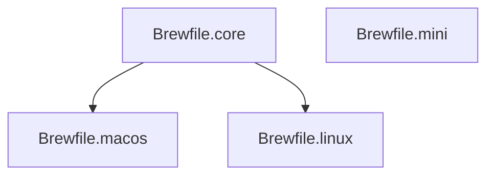

# 📦 Homebrew 包管理配置

本目录包含 Homeup 项目的所有 Homebrew 包定义，采用模块化、分层设计，支持多种环境配置。

## 📂 文件结构

```
packages/
├── Brewfile.core       # 核心工具（被 macos 和 linux 继承）
├── Brewfile.macos      # macOS 专属（GUI 应用 + 增强工具）
├── Brewfile.linux      # Linux 专属（无头模式工作站 + 服务器工具）
├── Brewfile.mini       # 独立轻量级配置（Dev Containers / Codespaces）
└── README.md           # 本文档
```

## 🎯 设计原则

### 分层继承架构

新的架构简化为三种场景：

1.  **macOS (GUI / Main)**: `Core` + `macOS`
2.  **Linux (Headless / SSH)**: `Core` + `Linux`
3.  **Mini (Ephemeral)**: `Mini` (独立，不继承 Core)



### 核心价值观

-   **少即是多**：只安装真正需要的工具
-   **无头 Linux**：Linux 环境被视为远程服务器/开发机，不包含 GUI 应用
-   **独立 Mini**：Mini Profile 完全独立，确保在容器中快速启动
-   **安全第一**：敏感密钥工具仅在 macOS 上完整启用

---

## 🛠️ 工具清单

### Brewfile.core - 基础层

被 `macos` 和 `linux` Profile 继承。包含最基础的现代化 Shell 环境。

#### Shell & 基础工具

| 工具 | 说明 |
| :--- | :--- |
| **zsh** | 强大的现代 Shell |
| **starship** | 跨 Shell 提示符 |
| **sheldon** | Zsh 插件管理器 |
| **zoxide** | 智能目录跳转 |
| **fzf** | 模糊搜索 |
| **atuin** | Shell 历史记录同步 |

#### 现代化替代品

| 工具 | 替代对象 | 说明 |
| :--- | :--- | :--- |
| **bat** | cat | 带语法高亮 |
| **eza** | ls | 更友好的列表显示 |
| **fd** | find | 快速文件查找 |
| **ripgrep** | grep | 快速文本搜索 |
| **sd** | sed | 简单替换工具 |
| **dust** | du | 磁盘分析 |
| **duf** | df | 磁盘使用情况 |
| **procs** | ps | 进程查看 |
| **btop** | top | 资源监控 TUI |

#### 开发基础

| 工具 | 说明 |
| :--- | :--- |
| **git** | 版本控制 |
| **gh** | GitHub CLI |
| **lazygit** | Git TUI |
| **neovim** | 文本编辑器 |
| **tmux** | 终端复用 |
| **direnv** | 环境变量管理 |
| **just** | 任务运行器 |
| **chezmoi** | Dotfiles 管理 |

---

### Brewfile.linux - Linux (Headless)

**继承 Core**。适用于远程开发机、服务器、Homelab。
合并了旧版 `workstation` (Linux) 和 `server` 的功能。

#### 增强监控 & 日志

| 工具 | 说明 |
| :--- | :--- |
| **glances** | 全面的系统监控 |
| **bmon** | 网络带宽监控 |
| **lnav** | 日志文件导航 |

#### 开发 & 运维工具

| 工具 | 说明 |
| :--- | :--- |
| **k9s** | Kubernetes TUI |
| **lazydocker** | Docker TUI |
| **terraform** | IaC 工具 |
| **ansible** | 自动化配置 |
| **mise** | 运行时管理 (Node, Python, Go) |
| **restic** | 备份工具 |

**注意**：此 Profile **不包含** 任何 GUI 应用。

---

### Brewfile.macos - macOS (Main)

**继承 Core**。适用于个人主力 MacBook。包含 GUI 应用和硬件密钥支持。

#### GUI 应用 (Casks)

-   **浏览器**: Google Chrome, Firefox
-   **终端**: Ghostty, Warp
-   **开发**: VS Code, DBeaver, Bruno
-   **工具**: 1Password, Obsidian, Stats, Raycast

#### 专属工具

| 工具 | 说明 |
| :--- | :--- |
| **pinentry-mac** | GPG 密码输入框 |
| **mas** | Mac App Store 命令行 |

---

### Brewfile.mini - Mini (Standalone)

**完全独立**。适用于 GitHub Codespaces, Dev Containers, 短期环境。
旨在提供"刚刚好"的开发体验，安装速度最快。

#### 包含内容

-   **Shell**: zsh, starship, sheldon
-   **编辑器**: neovim, tmux
-   **Git**: git, lazygit, git-delta
-   **工具**: bat, eza, ripgrep, fd, jq, zoxide, fzf
-   **运行时**: mise, uv, pnpm
-   **管理**: chezmoi, just

#### 排除内容

-   ❌ Ops 工具 (k9s, terraform, ansible)
-   ❌ 重型监控 (glances, netdata)
-   ❌ 历史同步 (atuin)
-   ❌ 系统更新 (topgrade)

---

## 📊 统计数据

| Profile | 组成 | 适用场景 |
| :--- | :--- | :--- |
| **macos** | Core + macOS | 个人电脑 |
| **linux** | Core + Linux | 服务器 / SSH 开发机 |
| **mini** | Mini (Standalone) | 容器 / 临时环境 |

---

## 🚀 使用方法

### 自动安装 (推荐)

使用项目根目录的 `bootstrap.sh` 脚本或 `just` 命令：

```bash
# macOS
just install-packages

# Linux Server
export HOMEUP_PROFILE=linux
just install-packages

# Mini / Container
export HOMEUP_PROFILE=mini
just install-packages
```

### 手动安装

```bash
# macOS
brew bundle --file=packages/Brewfile.core
brew bundle --file=packages/Brewfile.macos

# Linux
brew bundle --file=packages/Brewfile.core
brew bundle --file=packages/Brewfile.linux

# Mini
brew bundle --file=packages/Brewfile.mini
```

---

## 🔄 维护指南

1.  **核心通用**放 `core`。
2.  **Linux 服务器/开发**放 `linux`。
3.  **macOS 独有**放 `macos`。
4.  **容器必须**放 `mini`（注意 mini 不继承 core，需要独立添加）。

### ⚠️ Breaking Changes v2.0

-   **Linux Desktop 支持移除**：不再提供 Flatpak 安装列表。
-   **Profile 重命名**：`workstation` -> `macos`, `server` -> `linux`, `codespace` -> `mini`。